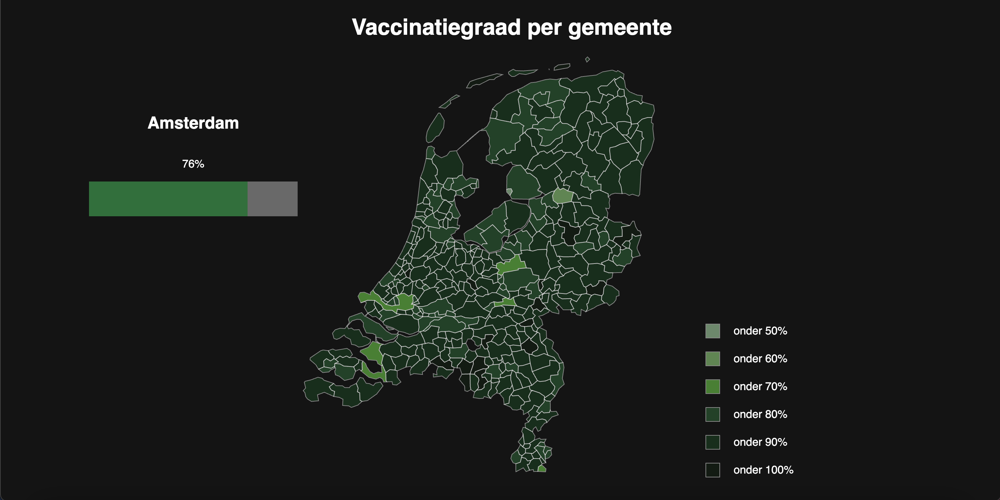

### Frontend Data

# Vaccination percentage per municipality

[Live version](https://jody29.github.io/frontend-data/)

## Table of contents
* [💡 Concept](https://github.com/jody29/frontend-data/blob/main/README.md#-concept)
* [⚙️ Installation](https://github.com/jody29/frontend-data#%EF%B8%8F-installation)
* [:pray: Wishlist](https://github.com/jody29/frontend-data#pray-wishlist)
* [:white_check_mark: Rubric](https://github.com/jody29/frontend-data#white_check_mark-rubric)
* [:information_source: Resources](https://github.com/jody29/frontend-data#information_source-resources)
* [:copyright: License](https://github.com/jody29/frontend-data#copyright-license)

## 💡 Concept
The concept for this project is to render a map of all the municipalities in the Netherlands. Every municipality gets a color which represents the percentage of people who are vaccinated in that municipality. This will show in which municipalities the most people are vaccinated. This will also show which municipalities have a low vaccination percentage

## ⚙️ Installation
Clone the repo to your own device
```bash
$ git clone https://github.com/jody29/frontend-data.git
```

## :pray: Wishlist
* When clicking on a municipality, zoom to the municipality
* Have the geojson file of 2021, because 3 municipalities have fused into one

## :white_check_mark: Assignment
Create a data visualisation (using the d3 library) based on given data where data can be explored through interaction using enter(), update(), and exit().

<table>
  <thead>
    <tr>
      <th></th>
      <th><strong>1-2</strong></th>
      <th><strong>3-4</strong></th>
      <th><strong>5-6</strong></th>
      <th><strong>7-8</strong></th>
      <th><strong>9-10</strong></th>
    </tr>
  </thead>
  <tbody>
    <tr>
      <th align="center" scope="row"><strong>Application</strong> of subject matter</th>
      <td align="center">Git <strong>and d3 are used</strong>; the project runs without errors; <strong>data is loaded with d3</strong>; there is a representation of data</td>
      <td align="center"><strong>Data is rendered with d3</strong>; interpreting the representation is easier that interpreting the data itself</td>
      <td align="center">Data is transformed; the data in the visualization is changed using the d3 update pattern to make an <strong>interactive representation.</strong></td>
      <td align="center">Representation and <strong>use of d3</strong> go beyond an example: there are demonstrable additions like well-chosen interaction methods, animation, multiple chart types, or user input</td>
      <td align="center">😱<br>The way the student applies subject matter  is more advanced than what they were taught in class; let’s switch places</td>
    </tr>
    <tr>
      <th align="center" scope="row">Understanding</th>
      <td align="center">There is substantial own code; the student can explain the code that exists</td>
      <td align="center">The student can explain some parts of their code, how some parts works together, and some technical choices</td>
      <td align="center">The student can explain every part of their code, how everything works together, and why software is used instead of alternatives; the project is structured logically</td>
      <td align="center">The project is complex but can easily be understood; alternatives to software covered in class was used that were great choices</td>
      <td align="center">🤓<br>The student deeply understands JavaScript and a geeky / nerdy conversation can be held about this</td>
    </tr>
    <tr>
      <th align="center" scope="row">Quality</th>
      <td align="center">The project is handed in on time, working, documented, and on GitHub</td>
      <td align="center">Code style is consistent; code and project  are partially documented</td>
      <td align="center">Code adheres to standards; docs cover what the project is and does</td>
      <td align="center">Code quality is good and enforced; docs are useful and professional</td>
      <td align="center">📚<br>Code and docs both read like great books</td>
    </tr>
    <tr>
      <th align="center" scope="row">Process</th>
      <td align="center">Process is partially documented</td>
      <td align="center">Process is properly documented</td>
      <td align="center">Choices are evaluated and documented; progress is demonstrated; Work tells a tory</td>
      <td align="center">Significant progress or iterations are demonstrated; Storytelling principles are applied</td>
      <td align="center">💪<br>What you did this course is amazing; Teachers are in awe of your progress</td>
    </tr>
  </tbody>
</table>

## :information_source: Resources
### Credits
* All the teachers at the [CMD Tech Track](https://github.com/cmda-tt).
* My support group.
* All other students who helped me in time of need.

### data sources
* Vaccination data by RIVM: [vaccination](https://data.rivm.nl/covid-19/COVID-19_vaccinatiegraad_per_gemeente_per_week_leeftijd.json)


## :copyright: License

